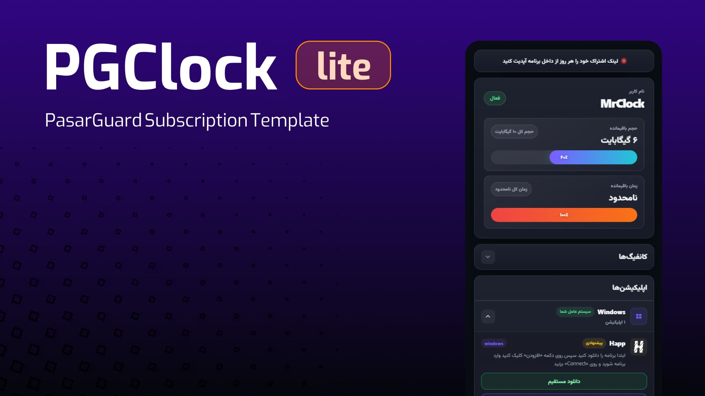

<div align="center">
  
</div>

<h1 align="center">PGClockLite</h1>

<p align="center" dir="rtl">
  قالب فارسی و سبک برای صفحه اشتراک کاربران پاسارگارد
</p>
<p align="center" dir="rtl">
🔴 این قالب تنها از زبان فارسی پشتیبانی میکند 🔴
</p>

---

<div dir="rtl" align="right">
 

<p><strong>ویژگی‌ها</strong></p>

- طراحی مدرن و مناسب موبایل
- نمایش اطلاعات حجم و زمان
- دریافت خودکار اپلیکیشن‌ها و اعلان از پنل
- نمایش لینک کانفیگ‌ها همراه با کپی و کیوآرکد
- تشخیص سیستم‌عامل و مرتب‌سازی اپلیکیشن‌ها
- کدنویسی سبک، تمیز و بدون نیاز به نصب ابزار اضافه

<p><strong>نصب سریع</strong></p>

وارد سرور پاسارگارد شوید و فایل قالب را دانلود کنید:

</div>

```bash
sudo mkdir -p /var/lib/pasarguard/templates/subscription/
sudo wget -N -P /var/lib/pasarguard/templates/subscription/ https://raw.githubusercontent.com/Mrclocks/PGClockLite/main/index.html
```

<div dir="rtl" align="right">

فایل تنظیمات پاسارگارد را ویرایش کنید:

</div>

```bash
sudo nano /opt/pasarguard/.env
```

<div dir="rtl" align="right">

مقادیر زیر را اضافه یا اصلاح کنید:

</div>

```env
CUSTOM_TEMPLATES_DIRECTORY="/var/lib/pasarguard/templates/"
SUBSCRIPTION_PAGE_TEMPLATE="subscription/index.html"
```

<div dir="rtl" align="right">

در پایان پاسارگارد را ریستارت کنید:

</div>

```bash
sudo pasarguard restart
```


<p><strong>تنظیم اعلان و اپلیکیشن‌ها از پنل</strong></p>

این قالب اعلان‌ها و لیست اپلیکیشن‌ها را از تنظیمات اشتراک پنل دریافت می‌کند؛ بنابراین برای ویرایش آن‌ها نیازی به تغییر فایل قالب نیست.

1. وارد پنل پاسارگارد شوید.
2. به بخش تنظیمات بروید.
3. وارد بخش اشتراک شوید.
4. متن اعلان و در صورت نیاز لینک اعلان را ویرایش کنید.
5. لیست برنامه‌ها را در قسمت اپلیکیشن‌ها اضافه یا ویرایش کنید.

قالب به صورت خودکار برنامه‌ها را بر اساس سیستم‌عامل مرتب می‌کند و اگر سیستم‌عامل کاربر قابل تشخیص باشد، همان دسته را در اولویت نمایش می‌دهد.

</div>
